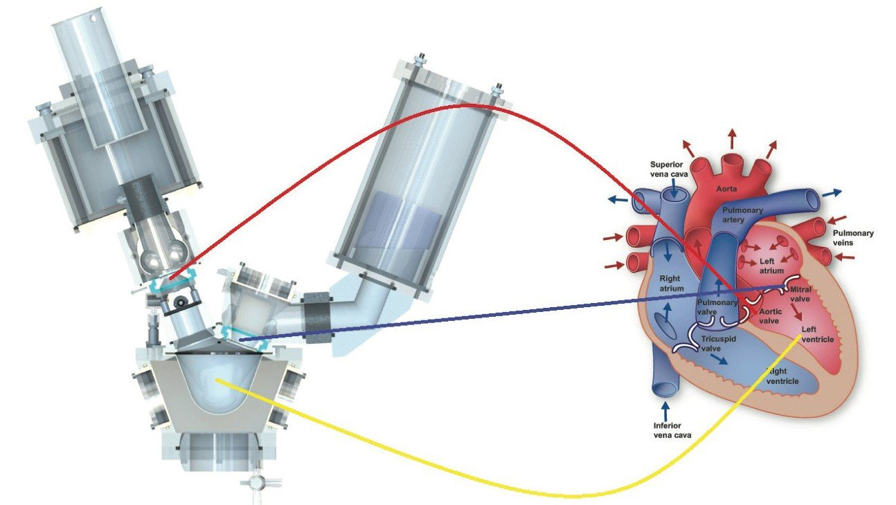

# Pulse_Duplicator_System
An experiment is conducted using a pulse duplicator system to simulate cardiovascular function. The pressure within the left ventricle and aorta is recorded over time. A Python code is used to visualize the data, apply signal filtering, and perform relevant calculations.

<p align="center">


## Libraries Used


## The Code 
Importing the libraries used in this project. 
```python
#import modeules 
import matplotlib.pyplot as plt 
import pandas as pd 
from scipy.signal import find_peaks 
import numpy as np
```

First, the left ventricle is graphed against time. To genrealise the code, the user is also asked to input the file they wish to process. 

```python
#Analyse left_ventricle pressure
LVP_filename = input("Enter Left Ventricle Pressure File").replace(" ","")

LVP = pd.read_csv(LVP_filename, names = ['time','pressure'], delimiter = '\\s+')
ax = LVP.plot(x = 'time', y = 'pressure')
ax.set_xlabel("time (s)")
ax.set_ylabel("pressure (mmHg)")
ax.set_title("Left Ventricle Pressure")
plt.show()
```

<p align="center">

